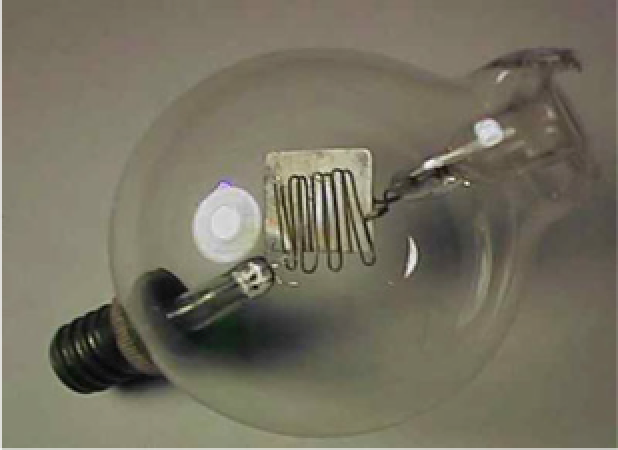
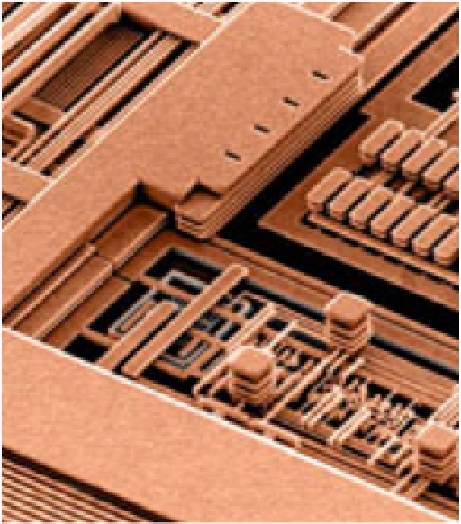
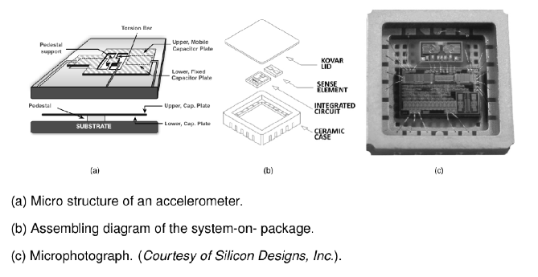

# Einleitung

## Wissenschaftliches Rechnen / Datenwissenschaft
* [Python](https://www.anaconda.com/download/)
* [Matlab](https://de.mathworks.com)
* [Command-line tools](https://jeroenjanssens.com/dsatcl/) 

## EDA Tools

-   PCB / System Design
    -   [LTspice](https://www.analog.com/en/design-center/design-tools-and-calculators/ltspice-simulator.html)
    -   [KiCad EDA](https://www.kicad.org/)
    -   [Altium Designer](https://www.altium.com/de/altium-designer)
    -   [SiemensEDA PCB tools](https://eda.sw.siemens.com/en-US/pcb/products/)
    -   [cadence System Design & Analysis](https://www.cadence.com/en_US/home/tools/system-design-and-analysis.html)
-   IC / Silicon Design
    -   [IIC-OSIC-TOOLS (open-source)](https://github.com/iic-jku/IIC-OSIC-TOOLS)
    -   [SiemensEDA IC tools](https://eda.sw.siemens.com/en-US/ic/products/)
    -   [cadence IC Design & Verification](https://www.cadence.com/en_US/home/tools/design-excellence.html)
    -   [synopsys silicon design (IC)](https://www.synopsys.com/silicon-design.html)

## Betriebssystem (OS) - Werkzeuge (Tools)
* [SSH (Secure Shell)](https://de.wikipedia.org/wiki/Secure_Shell)
* [Microsoft-Terminal](https://github.com/microsoft/terminal)
* [Microsoft-PowerShell](https://learn.microsoft.com/de-de/powershell/scripting/learn/ps101/01-getting-started?view=powershell-7.4)
* [MacOS-Terminal](https://iterm2.com)
* [Linux/MacOS zsh-tools](https://ohmyz.sh)
* [Linux/MacOS bash-it](https://bash-it.readthedocs.io/en/latest/)
* [Git (Versionskontrolle)](https://git-scm.com)
* [TortoiseGit – Windows Shell Interface to Git](https://tortoisegit.org/)

## Code Editoren
* [Visual Studio Code](https://code.visualstudio.com)
* [Spyder IDE](https://www.spyder-ide.org)
* [Thonny (Micro-)Python IDE](https://thonny.org)
* [Emacs](https://www.gnu.org/software/emacs/)
* [Vim](https://www.vim.org)

## Berichtswesen / Laborberichte

* [quarto](https://quarto.org)
   * [Manuscripts](https://quarto.org/docs/manuscripts/)

* LaTeX
  * [MikTeX (Windows, MacOS, Linux)](https://miktex.org/)
  * [MacTeX (MacOS)](https://www.tug.org/mactex/)
  * [TeXLive (Linux)](http://tug.org/texlive/)

* LaTeX Editoren
  * [TeXStudio](http://www.texstudio.org)
  * [TeXMaker](http://www.xm1math.net/texmaker/)
  * [TeXWorks](http://www.tug.org/texworks/)

* Kollaborative Frameworks
  * [ShareLaTeX, Online LaTeX](https://www.sharelatex.com/)
  * [CoCalc - Online LaTeX](https://cocalc.com/doc/latex-editor.html)
	* ein Service der [AcademicCloud](https://academiccloud.de)

* Literaturverwaltung
  * [Zotero](https://www.suub.uni-bremen.de/service-beratung/literaturverwaltung/zotero/) 
  * [Citavi](https://www.suub.uni-bremen.de/service-beratung/literaturverwaltung/citavi-2/)

* Datenverarbeitung
  * Dateisystem Ordner und Dateien
  * Comma-Separated-Values (CSV), Tab-Separated-Values (TSV)
	* [csvkit](https://github.com/wireservice/csvkit)
	* [miller](https://github.com/johnkerl/miller)
  * Spreadsheet (.xlsx, .ods)

## Schöne neue Welt

 

## Halbleiterherstellung (Infineon, Dresden)



## FinFET (Intel)



## TSMC Fab (Next Gen 7/5 nm)



## Es war einmal ...

## Damals und heute

## Systemhierarchie

* Nutzen Sie Hierarchien zur Beschreibung komplexer Systeme

* Teile und herrsche

## Schnittstellen zur Aussenwelt

## Meeting mit einem System

## System in a Package (SiP)

## Sie werden unsere Experten

* Hintergrundwissen
  * Systemverständnis, Architektur, Herstellungsverfahren, Implementation

* Unterbewusste Kompetenz
  * Abgespeicherte Erfahrungen aus Erfolgsgeschichten und Misserfolgen

* Spezialwissen
  * Berufsspezifisches Wissen

* Teamwork Haltung
  * Kommunikationsfähigkeit, Berichtswesen und technische Präsentation

* Kreativität

* Tool-Kenntnisse

## Lernziele des Moduls

* Elektrische Systeme mathematisch und graphisch im Zeit- und Frequenzbereich beschreiben

* Netzwerkanalyse mit RLC-Gliedern

* Spezielle Netzwerke, wie Messbrücken, Schwingkreise und ideale Transformatoren, dimensionieren.

## Seminaristischer Unterricht

* Komplexe Wechselstromrechnung

* Diskrete Bauelemente und ihre Modellierung (RLC)

* Methodik der Netzwerkanalyse

* Anwendungsbeispiele mit EDA-Werkzeugen und wissenschaftliches Rechnen (Scientific Computing)

## Beschreibung elektrotechnischer Systeme

* verschiedene Stufen der Vereinfachung

* Felder / Wellen / Optik / HF-Technik
  
  * Maxwell-Gleichungen
	\begin{align}
	\oint \mathbf{H} d\mathbf{s} &= \iint \mathbf{J} + \dot{D} d\mathbf{A} \\
	\oint \mathbf{E} d\mathbf{s} &= - \iint \dot{B} d\mathbf{A}
	\end{align}
	

* bei lokaler Konzentration der Feldenergie $\Rightarrow$ quasi-statische Näherung

* Mikrowellentechnik / Leitungstechnik
  
  * verteilte Schaltungen $l$, $c$, $\rho$
  
  * Kopplung, Laufzeit $\tau = a/v$

* *kleine* Systeme mit $a << \lambda$ bzw. *kurze* Laufzeiten mit $\tau << T$

* Regelungstechnik / Impulstechnik
  
  * Ersatzschaltungen
  
  * (Block-)Schaltbilder

* eingeschwungener Zustand

* NF-Technik
  
  * stationär-periodische Signale

* Sinussignale

* Energietechnik
  
  * monofrequente Signale $\underline{U} = \underline{Z} \cdot \underline{I}$

* Frequenz $f \rightarrow 0$

* Gleichstromtechnik
  
  * Ohmsches Gesetz $U = R \cdot I$

## Konzentrierte Schaltelemente

::: {.callout-note}

### Stromdichte

$$
\frac{\int E(r,t) ds}{\iint J(r,t) dA} = \frac{u(t)}{i(t)} \Rightarrow R
$$
:::

::: {.callout-note}

### Verschiebungsdichte

$$
\frac{\iint D(r,t) dA}{\int E(r,t) ds} = \frac{q(t)}{u(t)} \Rightarrow C
$$
:::

::: {.callout-note}

### Flußdichte

$$
\frac{\iint B(r,t) dA}{\oint H(r,t) ds} = \frac{u(t)}{i(t)} \Rightarrow L
$$
:::

## Harmonische Signale

::: {.callout-note}

### als Zeitfunktion

$$
u(t) = \hat{u} \sin(\omega t + \varphi)
$$
:::

::: {.callout-note}

### als Zeiger / komplexe Grösse (Phasor)

$$
\underline{\hat{u}} = \\hat{u} e^{j \varphi}
$$
:::
